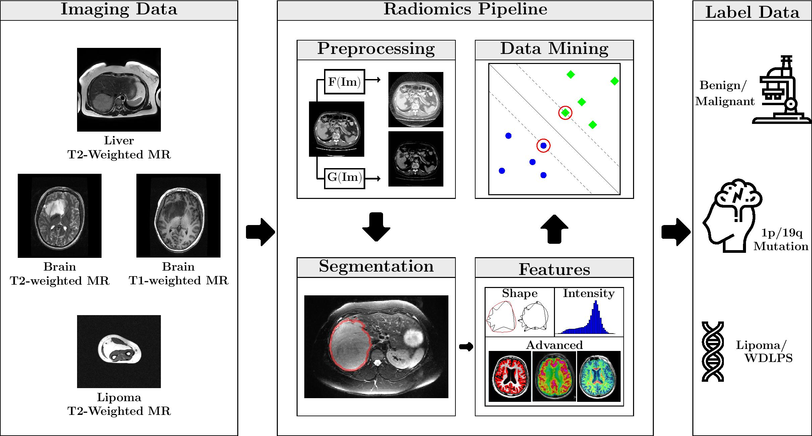

# WORC v3.4.2
## Workflow for Optimal Radiomics Classification

## Information

| Linux                          | Windows                       | Documentation                 | PyPi                          |Citing WORC          |
|--------------------------------|-------------------------------|-------------------------------|-------------------------------|---------------------|
| [![][tci-linx]][tci-linx-lnk]  | [![][tci-wind]][tci-wind-lnk] | [![][doc]][doc-lnk]           | [![][pypi]][pypi-lnk]         | [![][DOI]][DOI-lnk] |

[tci-linx]: https://travis-ci.com/MStarmans91/WORC.svg?token=qyvaeq7Cpwu7hJGB98Gp&branch=master&job=1
[tci-linx-lnk]: https://travis-ci.com/MStarmans91/WORC

[tci-wind]: https://travis-ci.com/MStarmans91/WORC.svg?token=qyvaeq7Cpwu7hJGB98Gp&branch=master&job=2
[tci-wind-lnk]: https://travis-ci.com/MStarmans91/WORC

[doc]:https://readthedocs.org/projects/worc/badge/?version=latest
[doc-lnk]: https://worc.readthedocs.io/en/latest/?badge=latest

[pypi]: https://badge.fury.io/py/WORC.svg
[pypi-lnk]: https://badge.fury.io/py/WORC

[DOI]: https://zenodo.org/badge/DOI/10.5281/zenodo.3840534.svg
[DOI-lnk]: https://zenodo.org/badge/latestdoi/92295542

# Introduction

WORC is an open-source python package for the easy execution of full radiomics pipelines.

We aim to establish a general radiomics platform supporting easy integration of other tools. With our modular build
and support of different software languages (python, MATLAB, ruby, java etc.), we want to facilitate and stimulate
collaboration, standardisation and comparison of different radiomics approaches. By combining this in a single framework,
we hope to find a universal radiomics strategy that can address various problems.

## License
This package is covered by the open source [APACHE 2.0 License](APACHE-LICENSE-2.0).

When using WORC, please cite this repository as following:

``Martijn P.A. Starmans, Sebastian R. van der Voort, Thomas Phil and Stefan Klein. Workflow for Optimal Radiomics Classification (WORC). Zenodo (2018). Available from:  https://github.com/MStarmans91/WORC. DOI: http://doi.org/10.5281/zenodo.3840534.``

For the DOI, visit [![][DOI]][DOI-lnk].

## Disclaimer
This package is still under development. We try to thoroughly test and evaluate every new build and function, but
bugs can off course still occur. Please contact us through the channels below if you find any and we will try to fix
them as soon as possible, or create an issue on this Github.

## Tutorial and Documentation
The WORC tutorial is hosted in a [separate repository](https://github.com/MStarmans91/WORCTutorial).

The official documentation can be found at [https://worc.readthedocs.io](https://worc.readthedocs.io).

## Installation

WORC currently only supports Unix with Python 3.6+ (tested on 3.7.2 - 3.7.4) systems and
has been tested on Ubuntu 16.04 and 18.04, and Windows 10. For detailed installation
instructions, please check  [the ReadTheDocs installation guidelines](https://worc.readthedocs.io/en/latest/static/quick_start.html#installation).

The package can be installed through pip:

      pip install WORC

Alternatively, you can directly install WORC from this repository:

      python setup.py install

Make sure you install the requirements first:

      pip install -r requirements.txt

NOTE: The version of PyRadiomics which WORC currently uses requires numpy to be installed beforehand. Make sure you do so, e.g.

      pip install numpy

## 3rd-party packages used in WORC:

 - SimpleITK (Image loading and preprocessing)
 - [Pyradiomics](https://github.com/radiomics/pyradiomics)
 - [PREDICT](https://github.com/Svdvoort/PREDICTFastr)
 - scikit-learn
 - imbalanced-learn
 - xgboost
 - [fastr (Workflow design and building)](http://fastr.readthedocs.io)
 - [ComBat](https://github.com/Jfortin1/ComBatHarmonization) (optional)

See for other python packages the [requirements file](requirements.txt).

## Start
We suggest you start with the [WORC Tutorial](https://github.com/MStarmans91/WORCTutorial).
Besides a Jupyter notebook with instructions, we provide there also an example script for you to get started with.

## WIP
- We are writing the paper on WORC.
- We are expanding the example experiments of WORC with open source datasets.

## Contact
We are happy to help you with any questions. Please sent us a mail or place an issue on the Github.

We welcome contributions to WORC. For the moment, converting your toolbox into a FASTR tool is satisfactory:
see also [the fastr tool development documentation](https://fastr.readthedocs.io/en/stable/static/user_manual.html#create-your-own-tool).

## Optional
Besides the default installation, there are several optional packages you could install to support WORC.

### Graphviz
WORC can draw the network and save it as a SVG image using [graphviz](https://www.graphviz.org/). In order to do so,
please make sure you install graphviz. On Ubuntu, simply run

      apt install graphiv

On Windows, follow the installation instructions provided on the graphviz website.
Make sure you add the executable to the PATH when prompted.

### Elastix
Image registration is included in WORC through [elastix and transformix](http://elastix.isi.uu.nl/).
In order to use elastix, please download the binaries and place them in your
fastr.config.mounts['apps'] path. Check the elastix tool description for the correct
subdirectory structure. For example, on Linux, the binaries and libraries should be in "../apps/elastix/4.8/install/"  and
"../apps/elastix/4.8/install/lib" respectively.

Note: optionally, you can tell WORC to copy the metadata from the image file
to the segmentation file before applying the deformation field. This requires
ITK and ITKTools: see  [the ITKTools github](https://github.com/ITKTools/ITKTools)
for installation instructions.

### XNAT
We use the XNATpy package to connect the toolbox to the XNAT online database platforms. You will only
need this when you use the example dataset we provided, or if you want to download or upload data from or to XNAT. We advise you to specify
your account settings in a .netrc file when using this feature for your own datasets, such that you do not need to input them on every request.
